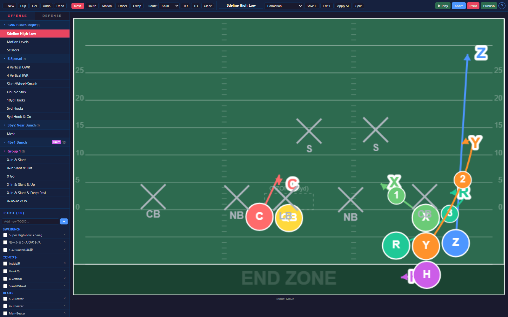
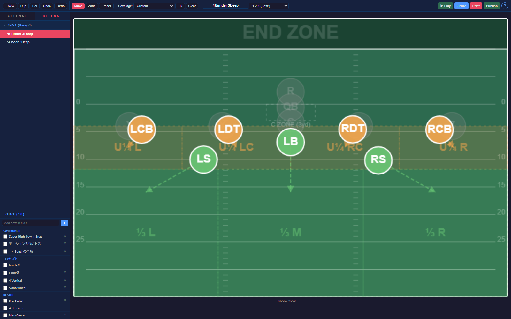
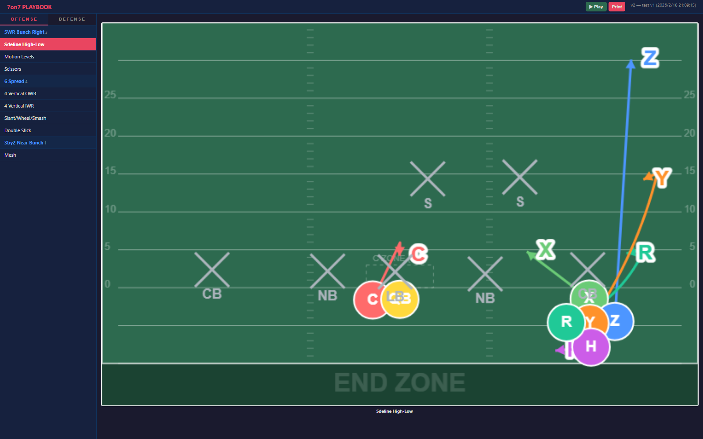

# 7on7 Playbook

<p align="center">
  Design offense and defense installs on a real field, publish a read-only viewer, and print clean play sheets from one app.
</p>

<p align="center">
  
  
  
  
  
</p>

7on7 Playbook is a browser-based coaching tool for building passing game installs, defensive calls, and player-facing viewer pages without switching between whiteboards, slides, and PDFs.

## Why This Exists

Most playbook tools are either too generic or too static. This app is built for the actual coaching loop:

- sketch a concept on the field
- duplicate it into variations
- organize it by formation
- publish a viewer version for players
- print install sheets when you need paper

## At a Glance

<p align="center">
  
</p>

<p align="center">
  
</p>

<p align="center">
  
</p>

## What You Can Do

### Build offensive plays

- Place players directly on the field
- Draw routes, motion, and curved stems
- Save and reuse custom formations
- Split formations into sub-groups for alternate personnel looks

### Build defensive calls

- Switch into a dedicated defense workspace
- Start from fronts like `4-2-1`
- Apply coverage presets such as Cover 1, 2, 3, 4, and 6
- Adjust individual zone assignments visually on the field

### Share without giving edit access

- Publish the current playbook to a separate viewer page
- Protect editor and viewer with different passwords
- Run the editor and viewer on separate ports
- Give players a clean read-only interface instead of the full editor

### Print install-ready sheets

- Print grouped play sheets directly from the browser
- Keep offense and defense separated for cleaner handouts

## Typical Coaching Workflow

1. Create a formation and build the base concept.
2. Duplicate the play into tags, beaters, or formation-adjusted variants.
3. Flip to defense and build the matching coverage or install note.
4. Publish the latest version for players in the viewer.
5. Print for practice or game-day wristband prep.

## Feature Highlights

| Area | What it gives you |
| --- | --- |
| Offense editor | Route drawing, motion, formations, duplicate/delete, play grouping |
| Defense editor | Coverage presets, zone overlays, defender assignments |
| Viewer | Read-only published version for players and assistants |
| Sharing | URL sharing from the editor plus publish-to-viewer workflow |
| Output | Browser print layout for install sheets |
| Storage | Local SQLite database via `playbook.db` |

## Quick Start

### Local

```bash
git clone https://github.com/shunnakamu/7on7-playbook.git
cd 7on7-playbook
copy .env.example .env
npm install
npm start
```

Open:

- Editor: `http://localhost:3000`
- Viewer: `http://localhost:3001`

Set these before real use:

- `EDITOR_PASSWORD`
- `VIEWER_PASSWORD`

### Docker

```bash
copy .env.example .env
docker compose up -d --build
```

More setup detail is in [SETUP.md](./SETUP.md).

## Main Controls

| Control | Purpose |
| --- | --- |
| `Move` | Reposition players and route waypoints |
| `Route` | Draw standard route segments |
| `Motion` | Draw pre-snap motion segments |
| `Zone` | Assign defensive zone responsibility |
| `Swap` | Swap offensive player positions |
| `Publish` | Push the current playbook to the viewer |
| `Share` | Generate a shareable editor URL |
| `Print` | Output print-friendly sheets |

## Keyboard Shortcuts

| Key | Action |
| --- | --- |
| `M` | Move mode |
| `R` | Route mode |
| `T` | Motion mode |
| `E` | Eraser mode |
| `Z` | Zone mode |
| `S` | Swap mode |
| `Space` | Start or stop animation |
| `Delete` | Delete hovered route |

## Storage and Publishing

- The working playbook is stored in `playbook.db`
- Published versions are stored separately and shown in the viewer
- By default the editor runs on port `3000` and the viewer runs on port `3001`

## Good Fit If You Want To

- install a 7-on-7 passing concept library
- keep offense and defense installs in one place
- publish a simplified viewer for players
- print play sheets without rebuilding diagrams in slides
